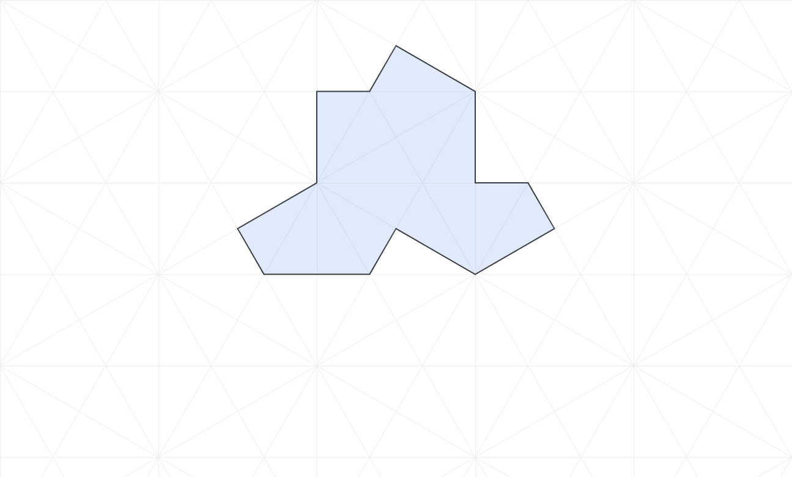
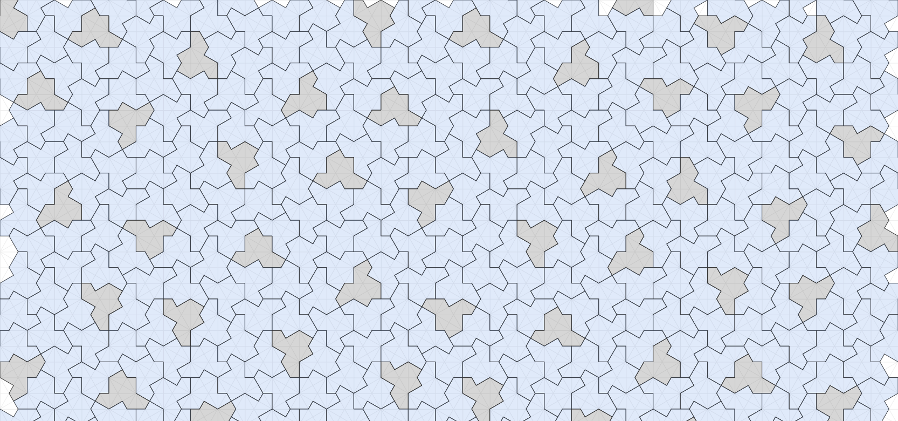

# The Hat, the Spectre and SAT solvers

## The Hat

It is quite unusual that a discovery in mathematics is understandable by the general public, but 2023 witnessed precisely that.

In November of 2022 just as ChatGPT was going to take world by a storm, David Smith a retired printer technician and amateur mathematician found a shape:



Thats is able to _tile_ the whole infinite plane in a non periodic way:



The announcement was made in a [paper](https://arxiv.org/abs/2303.10798) but you miht have heard of it in any of your favorite channels like [veritasium](https://www.youtube.com/watch?v=48sCx-wBs34), [numberphile](https://www.youtube.com/watch?v=_ZS3Oqg1AX0), 
[quanta magazine](https://www.quantamagazine.org/hobbyist-finds-maths-elusive-einstein-tile-20230404/) or even the 
[New York Times](https://www.nytimes.com/2023/03/28/science/mathematics-tiling-einstein.html).

The story of non periodic tilings of the plane is somewhat old and was popularized by Sir Roger Penrose and Martin Gadner in his famous Scientific American column on recreational mathematics. For example Penrose found [two tiles](https://en.wikipedia.org/wiki/Penrose_tiling) (the dart and the kite) that were able to tile the plane in a non periodic way


## The SAT solver

A [SAT solver](https://en.wikipedia.org/wiki/SAT_solver) is a computer program that solves aromatically problems in boolean algebra. Say you have a number of variables `a`, `b`, `c` , `d`, ... that can be either **true** or **false**. And then you have se series of statements regarding those variables, like:

* If `a` is **true** then either `b` is **true** or `c` is **false**.
* If `a` and `b` are both **true** if and only if `d` or `c` is false.

Solvers can deal with problems with a lot of variables. We will run some experiments in your browser with more than 60 thousand variables and millions of statements.

To be able to use a SAT Solver we first need to covert all of our logic statements in what is called a **[conjunctive normal form](https://en.wikipedia.org/wiki/Conjunctive_normal_form)** (CNF). We don't really need to explain much in here because as it happens the statements that we will produce are exactly in this from already.

In _conjunctive normal form_ we have a series of statements, called _clauses_, that all need to be true (those are the conjunction or AND blocks). Each clause is composed of an OR array of literals (variables and their negations). For example:

* a or b or not c
* a or d
* not c or d

This is compose of 3 clauses and there are 4 variables (a, b, c , d).

There is a general constructive theorem called the _Tseitin transformation_ that converts any problem in boolean logic to an equivalent in CNF.

As I said, in our case the problem will already de in CNF so we don't need to bother about that. The next step will be to write the problem in a way a Solver can digest it. The standard way is to assign a positive to each variable. For instance

* a -> 1
* b -> 2
* c -> 3
* d -> 4

The each clause is an array:

* a or b or not c <=> [1, 2, -3]

As a you can see a negative value means negation of the variable.

Once you feed the solver an array of arrays it returns an array like [1, -2, 3, -4] that means variable 1 and 3 are true and variables 2 and 4 are false. The solver might not find a solution and will return an error or might be able to prove that there is not a valid a solution and will return "UNSAT".

## A SAT Solver in wasm

There are a million SAT solvers out there but we will use [splr](https://github.com/shnarazk/splr) that we can compile to WASM, fits in a  200kb and runs in the browser.

Since we are communicating with wasm instead of passing an array of arrays to the solver we will pass just one array from which you can rebuild the array of arrays:

```
[(length, a_1, ..., a_l)*]
```

So, for instance the array of arrays:

```
[
    [5, -4, 7],
    [3, -5, 89, 3]
]
```

## Using a SAT solver to find solutions to the tiling problem
See [Hastings Greer's post](https://www.hgreer.com/HatTile/) for a solution using Microsoft z3 solver. 

We will mark a spacial vertex in a Hat:

Note that the vertex needs to be on at the center of an hexagon.

There are N x M hexagon centers and we can put 12 different hats on each. That means there are 12 x N x M statements.

* N(n, m, i) => There is a Hat(i) in position (n, m)
* SH(n, m, i) => There is a BarHat(i) in position (n, m)

We immediately have a few statements:

[-H(n, m, i), -H(n, m, j)]


[quanta magazine](https://www.quantamagazine.org/math-that-goes-on-forever-but-never-repeats-20230523/)


Original source:
[An aperiodic monotile](https://cs.uwaterloo.ca/~csk/hat/)


[borealis tutorial](https://www.borealisai.com/research-blogs/tutorial-9-sat-solvers-i-introduction-and-applications/)


Applications:

Craig Kaplan:
[patches of hats](https://cs.uwaterloo.ca/~csk/hat/app.html)
[H7/H8 substitution rules](https://cs.uwaterloo.ca/~csk/hat/h7h8.html)
[GitHub](https://github.com/isohedral/hatviz)


[Mathigon polypad](https://mathigon.org/polypad/8kVqVH2Mor6JTQ)


SAT Solver online:
[cryptominisat](https://msoos.github.io/cryptominisat_web/)
[GitHub](https://github.com/msoos/cryptominisat)

Craig S. Kaplan uses this solver (Heesch Numbers of Unmarked Polyforms):
[blog post](https://isohedral.ca/heesch-numbers-of-unmarked-polyforms/)
[paper](https://arxiv.org/pdf/2105.09438.pdf)
